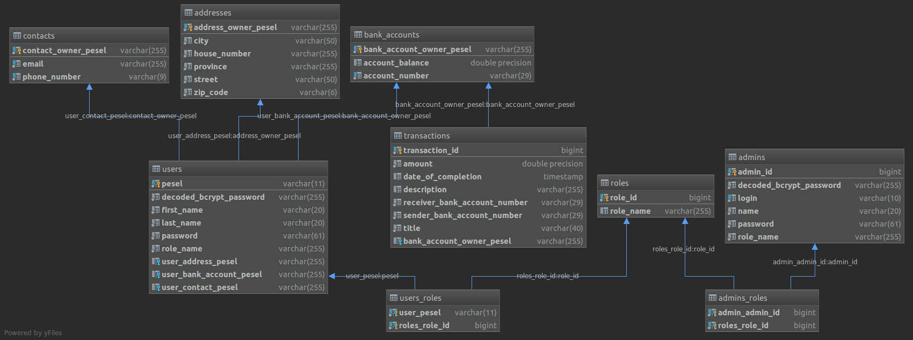

# Bank Account Rest API

## Table of contents
* [General info](#general-info)
* [Technologies](#technologies)
* [Application Programming Interface](#application-programming-interface)
* [Database structure](#database-structure)

#### General info
This project is a back-end API for the bank account application. 
I used design pattern called 'Facade Pattern'. 
Default running port is 8080. 
In src/main/resources folder, you will have an application config and a sql script with some fake data.

#### Technologies:
Project is created with:
* Java 8
* Maven
* Spring Boot
* Spring Data
* Spring Validation
* Spring Security
* Hibernate
* PostgreSQL
* Lombok
* Jackson
* Swagger

Intellij for code editor and Postman for testing an API.

#### Application Programming Interface

I used swagger to generate an API of this application. If you run an app, u can visit these links to see all API: 
* [http://localhost:8080/swagger-ui.html](http://localhost:8080/swagger-ui.html)
* [http://localhost:8080/v2/api-docs](http://localhost:8080/v2/api-docs)

#### Database structure

